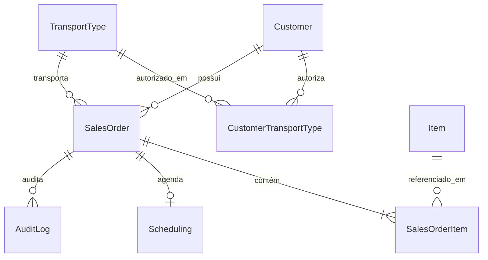
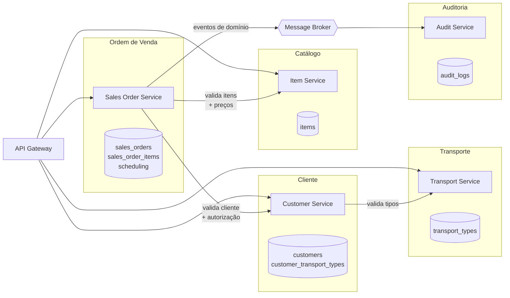

# Arquitetura — Estado Atual e Caminho para Microserviços

Este documento descreve **como o sistema está hoje** e serve de linha de base para a decomposição em microserviços. O foco é honesto: o que já está pronto para ser extraído, o que está acoplado, e em que ordem atacar.

- [Estado atual](#estado-atual)
- [Contextos delimitados](#contextos-delimitados)
- [O que já está pronto para decomposição](#o-que-já-está-pronto-para-decomposição)
- [Pontos de acoplamento](#pontos-de-acoplamento)
- [Fronteiras de serviço propostas](#fronteiras-de-serviço-propostas)
- [Ordem de extração](#ordem-de-extração)
- [Padrões necessários](#padrões-necessários)
- [Primeiro passo concreto](#primeiro-passo-concreto)

---

## Estado atual

**Monólito modular com arquitetura hexagonal.** Uma única aplicação NestJS, um único banco PostgreSQL, um único processo.

```
src/
├── domain/           # Entidades, portas (interfaces), regras de negócio. Zero dependência de framework.
├── application/      # Use cases — orquestram domínio + portas. Não conhecem Prisma nem HTTP.
├── infrastructure/   # Adapters: repositórios Prisma, listeners, HTTP, observabilidade.
└── presentation/     # Controllers, DTOs, módulos NestJS.
```

A regra de dependência aponta sempre para dentro: `presentation → application → domain`, e `infrastructure` implementa as portas definidas no `domain`. Nenhum use case importa Prisma ou NestJS-específico além dos decorators de DI.

### Grafo de módulos

```mermaid
graph TD
    App[AppModule]
    Shared[SharedModule<br/>@Global: PrismaService, UnitOfWork]
    Cust[CustomerModule]
    Trans[TransportTypeModule]
    Item[ItemModule]
    SO[SalesOrderModule]

    App --> Shared
    App --> Cust
    App --> Trans
    App --> Item
    App --> SO

    SO -.->|re-registra repositórios<br/>de Customer e Item| Cust
    SO -.-> Item
    Cust -.->|valida transportes| Trans
```

> A linha tracejada é relevante: `SalesOrderModule` **re-registra** `CustomerRepository` e `ItemRepository` como providers próprios em vez de importar os módulos donos. Isso funciona no monólito, mas mascara a dependência real entre contextos — que aparece explicitamente na decomposição.

### Modelo de dados



---

## Contextos delimitados

Os contextos já são visíveis na estrutura atual de módulos. Esta é a base da decomposição:

| Contexto          | Agregados / tabelas                              | Depende de           | Consumido por        |
| ----------------- | ------------------------------------------------ | -------------------- | -------------------- |
| **Catálogo**      | `Item`                                           | —                    | Sales Order          |
| **Transporte**    | `TransportType`                                  | —                    | Customer, Sales Order |
| **Cliente**       | `Customer`, `CustomerTransportType`              | Transporte           | Sales Order          |
| **Ordem de Venda** | `SalesOrder`, `SalesOrderItem`, `Scheduling`     | Cliente, Catálogo, Transporte | —          |
| **Auditoria**     | `AuditLog`                                       | — (só escuta eventos) | —                   |

**Catálogo** e **Transporte** são folhas: não chamam ninguém. **Auditoria** é puro consumidor: ninguém a chama, ela só reage a eventos. **Ordem de Venda** é o núcleo e concentra as dependências.

---

## O que já está pronto para decomposição

Estes pontos foram construídos com abstração suficiente para sobreviver à extração sem reescrita de regra de negócio:

**Portas de repositório são interfaces puras.** `ISalesOrderRepository`, `ICustomerRepository` etc. são `interface` TypeScript com tokens `Symbol` centralizados em `infrastructure/di-tokens.ts`. Trocar a implementação Prisma por um cliente HTTP/gRPC é uma troca de binding no módulo — nenhum use case muda.

```typescript
// hoje
{ provide: CUSTOMER_REPOSITORY, useClass: CustomerRepository }        // Prisma, mesmo processo
// depois
{ provide: CUSTOMER_REPOSITORY, useClass: CustomerHttpRepository }    // chamada remota
```

**A porta de eventos abstrai o broker.** `IEventEmitter` vive no domínio e só expõe `emit(event, payload)`. O `EventEmitter2` do NestJS é injetado pela infraestrutura. Migrar para RabbitMQ ou Kafka não toca nenhum use case.

**Auditoria já é desacoplada por evento.** `AuditListener` reage a `order.created`, `order.status.changed`, `order.delivery.scheduled`, `order.delivery.rescheduled` e `order.transport.changed`. Nenhum use case conhece o repositório de auditoria. Cada handler já trata erro isoladamente — falha de auditoria não derruba a operação de negócio.

**Eventos são emitidos após o commit.** Os use cases transacionais emitem fora do bloco `unitOfWork.execute`, então um rollback não gera evento fantasma.

**Regras de negócio estão no domínio, não nos use cases.** A máquina de estados (`SalesOrderEntity.transitionTo`) e as invariantes de agendamento (`SchedulingEntity.validateWindow`) são do domínio. Elas viajam junto com o agregado para o novo serviço.

**Observabilidade e correlação já existem.** `traceId` é propagado por interceptor, incluído nos logs estruturados e no envelope de resposta — pré-requisito para rastrear uma requisição atravessando serviços.

---

## Pontos de acoplamento

O que precisa ser resolvido antes ou durante a extração. Ordenado por dificuldade.

### 1. Transação distribuída na criação da ordem — **o bloqueador principal**

`create-sales-order.use-case.ts` lê Cliente e Itens **dentro da mesma transação de banco** em que grava a Ordem:

```typescript
await this.unitOfWork.execute(async (tx) => {
  const customer = await this.customerRepository.findById(input.customerId, tx);  // outro contexto
  const foundItems = await this.itemRepository.findByIds(itemIds, tx);            // outro contexto
  return this.salesOrderRepository.create(order, tx);                             // este contexto
});
```

Com Cliente e Catálogo em serviços separados, essa transação **deixa de existir** — não há como um `BEGIN` abranger três bancos. É o ponto que exige mais decisão de design, não só refatoração mecânica.

Caminhos possíveis:
- **Validação síncrona + consistência eventual**: consultar os serviços antes de abrir a transação local, aceitando a janela em que o dado pode mudar entre a validação e a gravação. Simples; adequado quando o custo de uma ordem inválida rara é baixo.
- **Replicação de dados de referência**: o serviço de Ordem mantém uma cópia local somente-leitura de clientes/itens, alimentada por eventos. Elimina a chamada síncrona no caminho crítico e mantém a transação local; exige lidar com defasagem.
- **Saga com compensação**: cria a ordem em estado pendente e confirma/cancela conforme as validações retornam. Mais robusto, mais complexo.

### 2. Chaves estrangeiras cruzando contextos

O schema tem FKs reais entre tabelas que virariam serviços distintos:

| FK                              | Cruza                     |
| ------------------------------- | ------------------------- |
| `SalesOrder.customerId`         | Ordem → Cliente           |
| `SalesOrder.transportTypeId`    | Ordem → Transporte        |
| `SalesOrderItem.itemId`         | Ordem → Catálogo          |
| `CustomerTransportType`         | Cliente ↔ Transporte      |
| `AuditLog.salesOrderId`         | Auditoria → Ordem         |

Ao separar os bancos, essas FKs precisam virar **referências por ID sem integridade referencial no banco** — a consistência passa a ser responsabilidade da aplicação.

`CustomerTransportType` merece atenção: é uma tabela de junção pura entre dois contextos. A decisão é de quem é a regra "este cliente pode usar este transporte" — provavelmente do **Cliente** (é um atributo do cliente), com o Transporte apenas fornecendo o catálogo de tipos válidos.

### 3. Banco e `PrismaService` compartilhados

`SharedModule` é `@Global()` e exporta `PrismaService` e `UNIT_OF_WORK` para toda a aplicação. Todo repositório aponta para a mesma instância e o mesmo banco. A separação de schemas por contexto precisa vir antes da separação física.

### 4. `IUnitOfWork` não sobrevive à fronteira

A porta atual assume um recurso transacional único (`prisma.$transaction`). Ela continua válida **dentro** de cada serviço, mas não pode ser usada para coordenar escritas entre serviços. Qualquer uso que hoje abranja dois contextos precisa ser substituído por saga.

### 5. Perda de evento entre commit e publicação

Os eventos são emitidos após o commit — correto para evitar evento fantasma, mas cria a janela oposta: se o processo cair entre o `COMMIT` e o `emit()`, o evento **se perde permanentemente**. No monólito com auditoria in-process, o impacto é uma linha de auditoria faltando. Com serviços consumindo esses eventos para atualizar estado próprio, isso vira divergência de dados silenciosa.

Solução: **padrão Outbox** — gravar o evento na mesma transação do dado, e um publicador separado lê a tabela de outbox e envia ao broker.

### 6. Idempotência declarada mas não implementada

Existe a exceção `DuplicateRequestException`, e o `HttpExceptionFilter` já a mapeia para HTTP 409 com header `X-Resource-Id`. Mas **nada a lança** — não há middleware, guard ou interceptor lendo um header de idempotência.

Em ambiente distribuído com retry automático, isso deixa de ser opcional: um retry de "criar ordem" sem chave de idempotência gera ordem duplicada.

---

## Fronteiras de serviço propostas



**Auditoria** só consome do broker — nunca é chamada diretamente. É a fronteira mais limpa do sistema.

---

## Ordem de extração

Do menor risco para o maior. Cada passo deixa o sistema funcionando.

### Passo 1 — Auditoria

**Por quê primeiro:** é puro consumidor de eventos. Nenhum código chama a auditoria de forma síncrona; ela só reage. Extraí-la não quebra nenhum caminho crítico — no pior caso, uma auditoria atrasa.

**O que muda:** trocar `EventEmitter2` por um broker real. O `AuditListener` vira o consumidor no novo serviço, praticamente sem alteração de código — os handlers já existem e já tratam erro.

**Pré-requisito:** implementar o Outbox, senão eventos perdidos viram lacunas de auditoria.

**Ganho:** valida toda a infraestrutura de mensageria (broker, serialização, versionamento de evento, retry, DLQ) num contexto onde falhas não são críticas.

### Passo 2 — Catálogo e Transporte

**Por quê:** são folhas — não dependem de ninguém. As dependências apontam *para* eles, nunca *deles* para fora.

**O que muda:** `IItemRepository` e `ITransportTypeRepository` ganham implementações que fazem chamada remota, injetadas nos serviços consumidores.

**Decisão a tomar:** chamada síncrona no caminho crítico, ou replicação local via evento? Para `unitPrice` — que é copiado para a linha do pedido no momento da criação — a replicação tende a ser melhor: evita uma chamada de rede por criação de ordem, e o preço já é congelado no pedido de qualquer forma.

### Passo 3 — Cliente

**Por quê agora:** depende só de Transporte, que já foi extraído.

**Ponto de atenção:** a regra de autorização de transporte (`CustomerTransportType`) vai junto — `isTransportAuthorized()` é uma regra do agregado Cliente. O serviço de Ordem passa a **perguntar** "este cliente pode usar este transporte?" em vez de carregar a lista e decidir localmente.

### Passo 4 — Ordem de Venda

O que sobra é o núcleo. `SalesOrder`, `SalesOrderItem` e `Scheduling` ficam juntos: a transação entre agendamento e mudança de status da ordem é uma invariante real do mesmo agregado e **deve** permanecer local.

Aqui é onde o bloqueador #1 tem que ter sido resolvido.

---

## Padrões necessários

| Padrão | Resolve | Quando |
| ------ | -------- | ------ |
| **Outbox** | Perda de evento entre commit e publicação (#5) | Antes do Passo 1 |
| **Idempotência por chave** | Retry gerando duplicata (#6) | Antes do Passo 2 |
| **Saga / compensação** | Transação distribuída na criação (#1) | Passo 4 |
| **Replicação por evento** | Chamada síncrona no caminho crítico (#1, #2) | Passos 2–3 |
| **Correlation ID entre serviços** | Rastreabilidade — já existe `traceId`, falta propagar via header/mensagem | Passo 1 |
| **Versionamento de evento** | Evolução de payload sem quebrar consumidores | Passo 1 |

---

## Primeiro passo concreto

Antes de extrair qualquer serviço, dois trabalhos preparatórios rendem valor imediato **mesmo que a migração pare aqui**:

**1. Implementar o Outbox no monólito.** Criar a tabela, gravar o evento na mesma transação do dado, e um publicador que lê e emite. Neste momento o "broker" ainda pode ser o `EventEmitter2` in-process — o ponto é que a garantia de entrega passa a existir. Quando o broker real chegar, só a ponta de publicação muda.

**2. Implementar idempotência.** A infraestrutura já está meio construída: `DuplicateRequestException` existe e o filter já a mapeia para 409 com `X-Resource-Id`. Falta o guard/interceptor que lê a chave do header, consulta um store e retorna a resposta anterior em vez de reprocessar.

Depois disso, corrigir o acoplamento de módulo apontado no grafo — `SalesOrderModule` deve **importar** `CustomerModule` e `ItemModule` e consumir os providers exportados, em vez de re-registrar os repositórios. Isso força as dependências entre contextos a ficarem explícitas no grafo de módulos, e é exatamente esse grafo que vira o desenho dos serviços.
