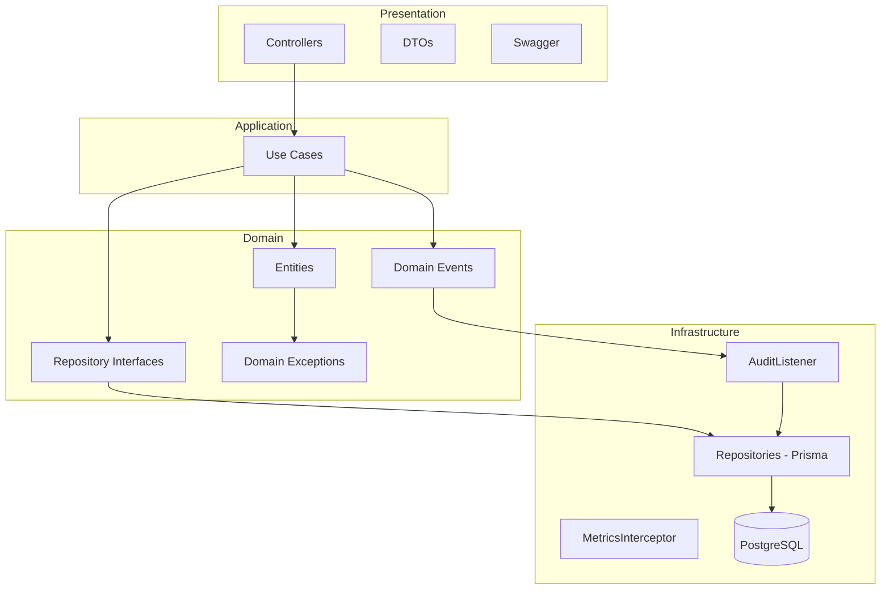
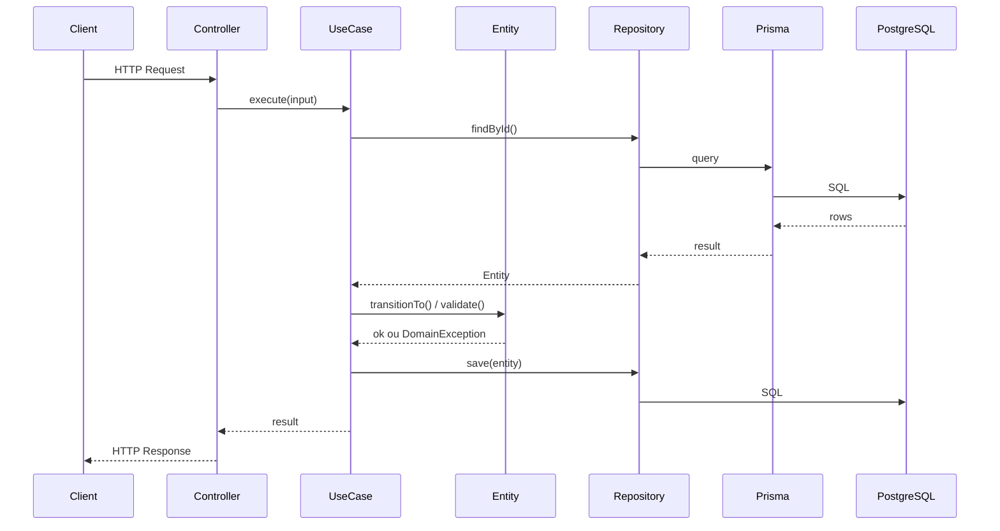
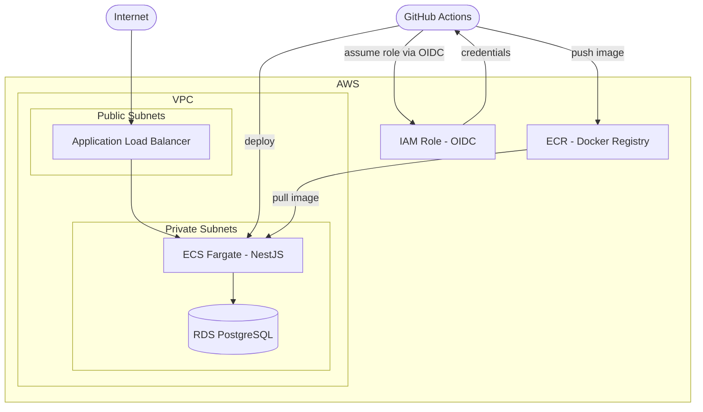

# Sales Order API (OVGS)

Sistema de Gestão de Ordens de Venda — API REST para gerenciamento do ciclo completo de Ordens de Venda, desde o cadastro de clientes e itens até o agendamento e rastreabilidade de entregas.

## Tecnologias

- **Runtime:** Node.js 24 + TypeScript
- **Framework:** NestJS 11 + Fastify
- **ORM:** Prisma 7
- **Banco de dados:** PostgreSQL 17
- **Validação:** class-validator + class-transformer
- **Documentação:** Swagger / OpenAPI
- **Testes:** Vitest
- **Logs:** nestjs-pino (JSON estruturado)
- **Métricas:** Prometheus + prom-client + @willsoto/nestjs-prometheus
- **Observabilidade:** Prometheus · Grafana · Loki · Promtail
- **Segurança:** @fastify/helmet, CORS, Throttler
- **Containerização:** Docker + Docker Compose
- **Infraestrutura:** Terraform + AWS (ECS Fargate, RDS, ECR, VPC, IAM)
- **CI/CD:** GitHub Actions

## Pré-requisitos

- Node.js 24+
- Docker e Docker Compose
- Yarn

## Como executar

### 1. Clone o repositório

```bash
git clone https://github.com/vidaal126/sales-order-api.git
cd sales-order-api
```

### 2. Configure as variáveis de ambiente

```bash
cp .env.example .env
```

### 3. Suba os containers

```bash
docker compose up -d
```

A aplicação sobe automaticamente com:

- Migrations aplicadas
- Prisma Client gerado
- Hot reload ativo (watch mode)

A API estará disponível em `http://localhost:3000`.
A documentação Swagger estará disponível em `http://localhost:3000/api/docs`.

## Endpoints

| Método | Rota                                | Descrição                    |
| ------ | ----------------------------------- | ---------------------------- |
| POST   | `/api/v1/customers`                 | Criar cliente                |
| GET    | `/api/v1/customers`                 | Listar clientes              |
| PUT    | `/api/v1/customers/:id`             | Atualizar cliente            |
| POST   | `/api/v1/transport-types`           | Criar tipo de transporte     |
| GET    | `/api/v1/transport-types`           | Listar tipos de transporte   |
| PUT    | `/api/v1/transport-types/:id`       | Atualizar tipo de transporte |
| POST   | `/api/v1/items`                     | Criar item                   |
| GET    | `/api/v1/items`                     | Listar itens                 |
| POST   | `/api/v1/sales-orders`              | Criar ordem de venda         |
| GET    | `/api/v1/sales-orders`              | Listar ordens (com filtros)  |
| GET    | `/api/v1/sales-orders/:id`          | Buscar ordem por ID          |
| PUT    | `/api/v1/sales-orders/:id/status`   | Atualizar status da ordem    |
| POST   | `/api/v1/sales-orders/:id/schedule` | Agendar entrega              |
| PUT    | `/api/v1/sales-orders/:id/schedule` | Reagendar entrega            |
| GET    | `/metrics`                          | Métricas Prometheus          |

## Fluxo operacional da Ordem de Venda

```
CRIADA → PLANEJADA → AGENDADA → EM_TRANSPORTE → ENTREGUE
```

Transições fora dessa sequência são rejeitadas com HTTP 422.

## Decisões arquiteturais

### Arquitetura Hexagonal



### Fluxo de uma Requisição



### Infraestrutura AWS



### Hexagonal Architecture (Ports & Adapters)

O domínio é o núcleo da aplicação e não depende de nenhum detalhe de infraestrutura. Controllers, repositories e serviços externos são adapters que se conectam ao domínio através de interfaces (ports).

```
Presentation (Controllers/DTOs)
        ↓
Application (Use Cases)
        ↓
Domain (Entities + Interfaces)
        ↑
Infrastructure (Repositories/Prisma)
```

Isso significa que é possível trocar Prisma por TypeORM, ou NestJS por Express, sem tocar em nenhuma regra de negócio.

### State Machine para Ordens de Venda

As transições de status da Ordem de Venda são controladas pela própria entidade `SalesOrderEntity` através de um mapa de transições válidas. Qualquer tentativa de transição inválida lança uma `DomainException` antes de chegar no banco de dados.

```typescript
const VALID_TRANSITIONS = {
  CRIADA: ["PLANEJADA"],
  PLANEJADA: ["AGENDADA"],
  AGENDADA: ["EM_TRANSPORTE"],
  EM_TRANSPORTE: ["ENTREGUE"],
  ENTREGUE: [],
};
```

### Event-Driven Audit

A auditoria é completamente desacoplada da lógica de negócio. Os Use Cases emitem domain events via `IEventEmitter` (porta de saída), e o `AuditListener` escuta esses eventos e persiste os registros automaticamente — sem que os Use Cases precisem conhecer o `AuditLogRepository`.

```
UseCase → emit('order.created') → AuditListener → AuditLogRepository
```

### Tipos de Transporte como dados

Os tipos de transporte (Caminhão, Carreta, Bi-truck) são cadastrados como dados, não como enums hardcoded. Isso satisfaz o requisito do sistema de permitir a inclusão de novos tipos sem alterar o código.

### Snapshot de preço nos itens da ordem

O `unitPrice` é copiado para `SalesOrderItem` no momento da criação da ordem. Mudanças futuras no preço do item não afetam ordens históricas.

## Estratégia de modelagem do domínio

| Entidade           | Responsabilidade                                                                 |
| ------------------ | -------------------------------------------------------------------------------- |
| `CustomerEntity`   | Guarda a lista de transportes autorizados e valida via `isTransportAuthorized()` |
| `SalesOrderEntity` | Encapsula a state machine de status via `transitionTo()` e `canTransitionTo()`   |
| `SchedulingEntity` | Controla agendamento e reagendamento de entregas                                 |
| `AuditLogEntity`   | Registra todos os eventos relevantes com estado anterior e posterior             |

## Estratégia de persistência

- **Prisma 7** com adapter `@prisma/adapter-pg` para conexão direta com PostgreSQL
- Schema separado por modelo em `src/infrastructure/database/prisma/models/`
- Índices criados em campos de filtro: `status`, `customerId`, `transportTypeId`, `createdAt`, `deliveryDate`
- Chave primária composta em `CustomerTransportType` (N:N sem coluna `id` extra)

## Observabilidade

A stack de observabilidade roda junto com a aplicação via Docker Compose.

| Serviço    | URL                   | Função                     |
| ---------- | --------------------- | -------------------------- |
| Prometheus | http://localhost:9090 | Coleta e armazena métricas |
| Grafana    | http://localhost:3001 | Dashboards (admin/admin)   |
| Loki       | http://localhost:3100 | Armazena logs estruturados |
| Promtail   | -                     | Coleta logs Docker → Loki  |

### Métricas coletadas

- `http_requests_total` — total de requisições por método, rota e status
- `http_request_duration_seconds` — histograma de latência (p50, p95, p99) por rota
- `http_errors_total` — total de erros 4xx/5xx por rota
- Default metrics do Node.js (process*\*, nodejs*\*) via prom-client

### Dashboard Grafana

O dashboard **Sales Order API - Base Monitoring** é provisionado automaticamente e inclui:

- HTTP Requests/min
- HTTP Error Rate %
- HTTP Latency (p50, p95, p99)
- Requests by Route
- Latency by Route (p95)
- 5xx e 4xx Errors by Route
- Logs (App) via Loki

### Endpoint de métricas

O endpoint `/metrics` é registrado diretamente na instância Fastify raw, bypassando o roteamento NestJS para compatibilidade com URI versioning:

```
GET http://localhost:3000/metrics
```

## Testes

```bash
# Unitários e integração
yarn test

# Com cobertura
yarn test:cov
```

### Cobertura atual

- **9 testes unitários** — State machine da `SalesOrderEntity`
- **4 testes unitários** — `CreateSalesOrderUseCase` com mocks
- **2 testes de integração** — `CreateSalesOrderUseCase` com banco real

## CI/CD

### CI (`.github/workflows/ci.yml`)

Roda em todo push e Pull Request para `main`:

1. Install dependencies
2. Prisma generate (antes do type check — tipos gerados necessários)
3. Type check (`tsc --noEmit`)
4. Lint (Biome + ESLint)
5. Migrations
6. Tests

### CD (`.github/workflows/cd.yml`)

Deploy automático na `main` (desabilitado até infraestrutura AWS ser provisionada):

1. Autenticação via OIDC (sem chaves estáticas)
2. Login no ECR
3. Build + push da imagem Docker
4. Deploy no ECS Fargate
5. Aguarda estabilização do serviço

## Infraestrutura AWS (Terraform)

A infraestrutura é provisionada via Terraform modular em `terraform/`:

```
terraform/
├── modules/
│   ├── vpc/        # VPC, subnets, IGW, NAT Gateway
│   ├── iam/        # OIDC Provider, roles GitHub Actions + ECS
│   ├── ecr/        # Repositório de imagens + lifecycle policy
│   ├── rds/        # PostgreSQL 17 gerenciado, Multi-AZ
│   └── ecs/        # Cluster, Task Definition, Service, ALB
└── environments/
    └── production/ # Configuração de produção com backend S3
```

### Por que cada serviço?

| Serviço     | Justificativa                                                         |
| ----------- | --------------------------------------------------------------------- |
| ECS Fargate | Sem gerenciar servidores — suficiente para aplicação single-container |
| RDS         | Backups automáticos, failover, patches gerenciados                    |
| ECR         | Repositório privado com integração nativa ao ECS                      |
| ALB         | Load balancer com health check automático                             |
| OIDC + IAM  | Credenciais temporárias (15min) — sem chaves estáticas no GitHub      |

### Provisionar infraestrutura

```bash
cd terraform/environments/production
terraform init
terraform plan
terraform apply
```

Os outputs incluem os valores necessários para configurar os GitHub Secrets do CD workflow.

## Considerações sobre escalabilidade

A arquitetura está preparada para evoluir sem grandes refatorações:

- **Message broker:** O `IEventEmitter` (porta de saída) pode ser substituído por um adapter RabbitMQ ou Kafka sem alterar os Use Cases
- **Cache:** Consultas de monitoramento operacional podem receber uma camada Redis nos repositórios sem impacto no domínio
- **Read model:** O `findAll` com filtros pode ser extraído para um repositório de leitura separado (CQRS)
- **Auto-scaling:** ECS Service Auto Scaling com CloudWatch alarms baseado em CPU/memória
- **Microserviços:** Cada módulo (Customer, SalesOrder, Scheduling) pode ser extraído para um serviço independente

## Considerações sobre performance

- Índices criados em todos os campos usados em filtros e joins
- `findByIds` usa `WHERE id IN (...)` em vez de N queries individuais
- `include` do Prisma usado estrategicamente para evitar N+1
- Route templates (não URLs reais) nas métricas para baixa cardinalidade

## Trade-offs assumidos

| Decisão                                 | Trade-off                                                                       |
| --------------------------------------- | ------------------------------------------------------------------------------- |
| Prisma Schema separado por arquivo      | Usa `prismaSchemaFolder` (Prisma 7 estável) — sem suporte em versões anteriores |
| `updatedAt` gerenciado pelo Prisma      | A entidade de domínio reflete o valor persistido, não calcula em memória        |
| Audit via EventEmitter2 in-process      | Simples e suficiente para o escopo — em produção migraria para broker externo   |
| Sem paginação nos endpoints de listagem | Fora do escopo do desafio — adicionaria `cursor-based pagination` em produção   |
| Testes de integração com banco real     | Requer banco rodando — em CI usa service container PostgreSQL                   |
| ECS Fargate sem auto-scaling            | `desired_count=1` — em produção configuraria auto-scaling por CPU/memória       |
| /metrics via Fastify raw                | Necessário para compatibilidade com URI versioning — bypassa middleware NestJS  |
